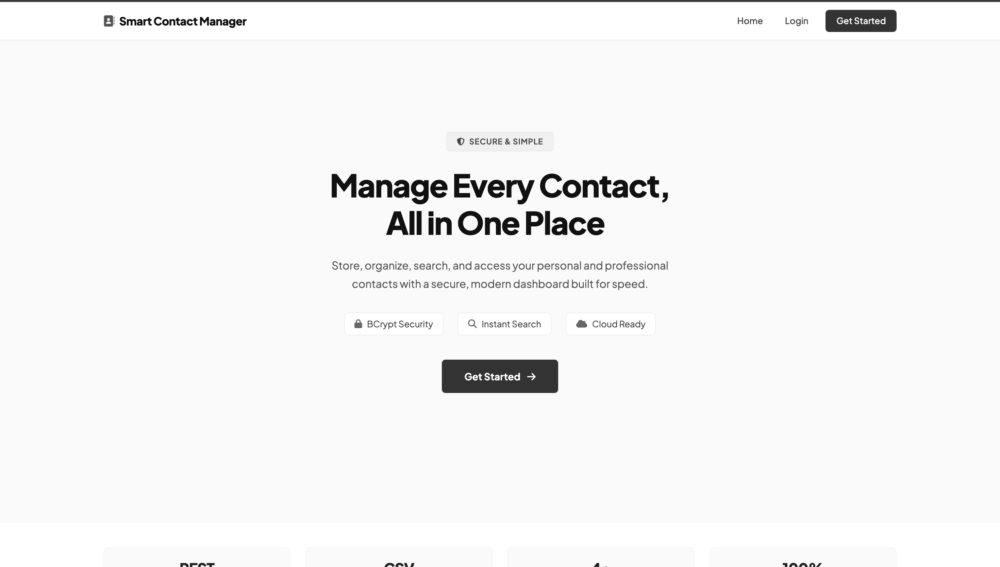
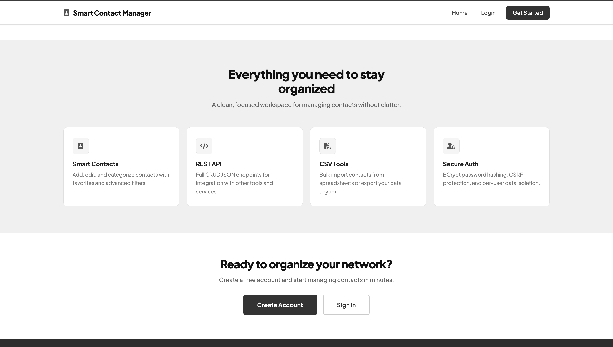
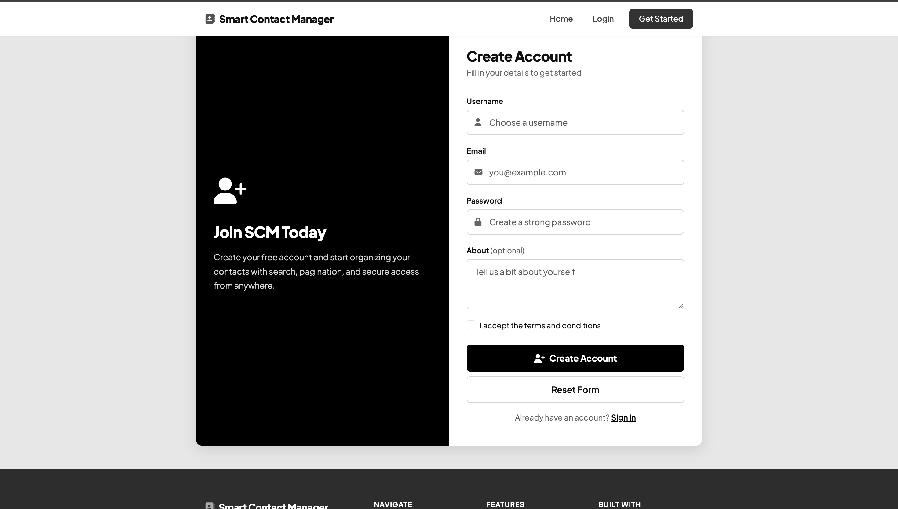
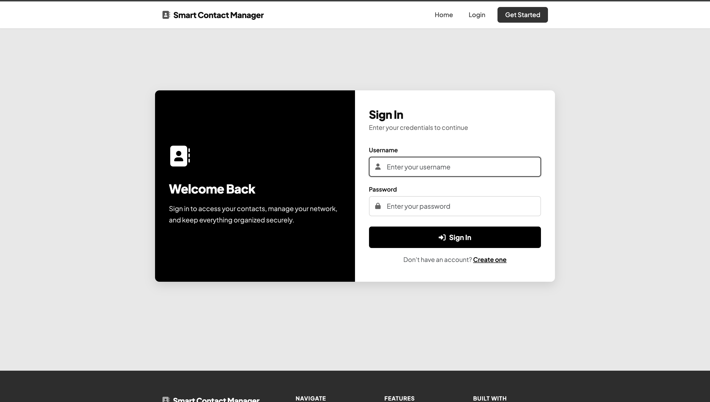
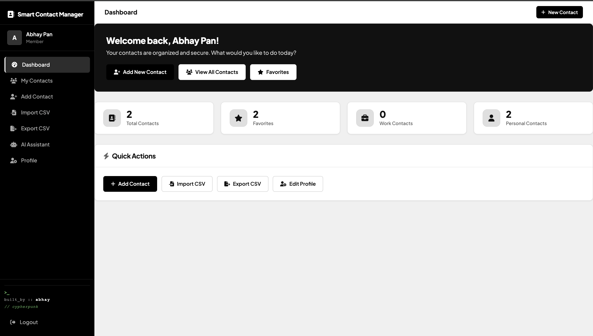
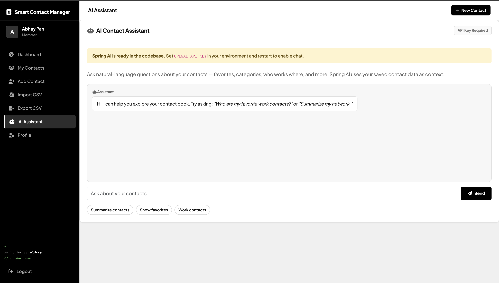
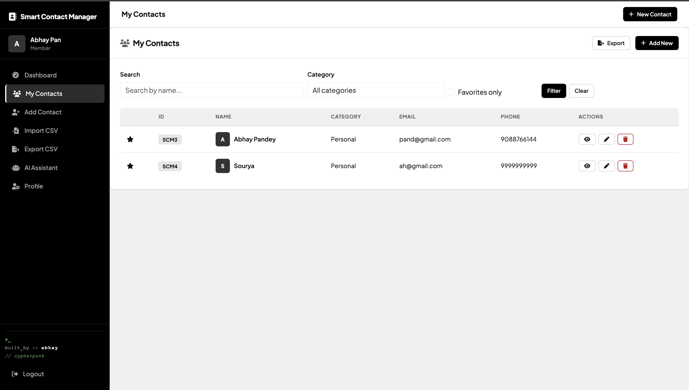
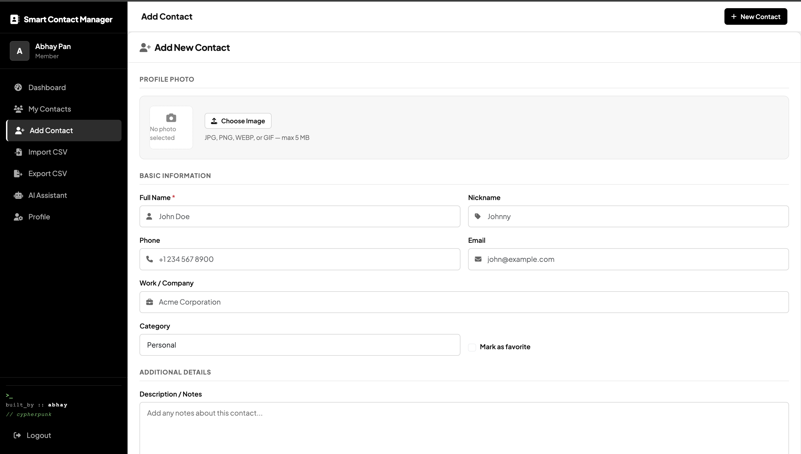
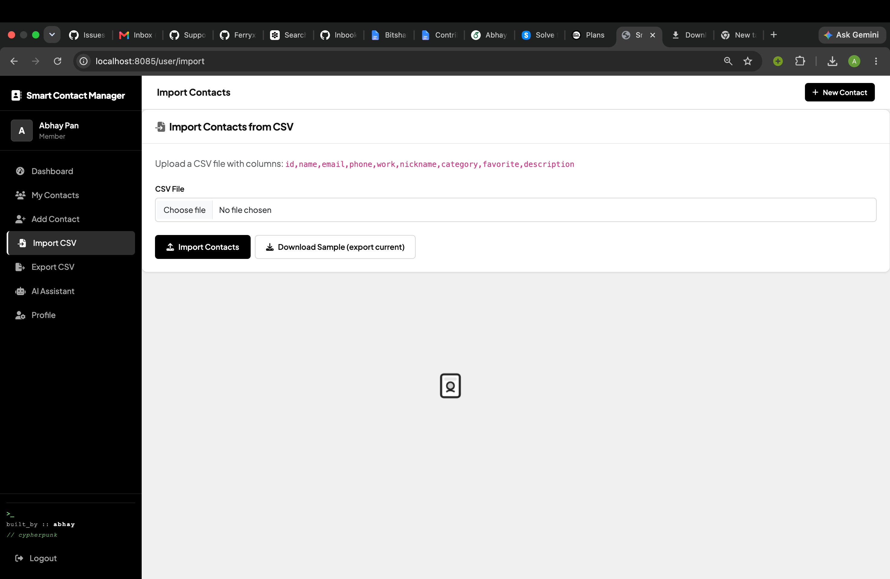
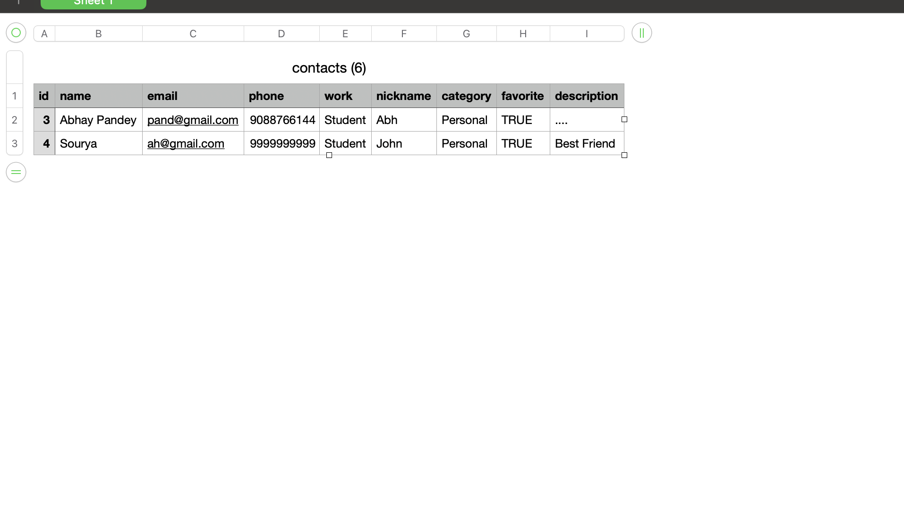

# Smart Contact Manager

A secure full-stack contact management web application built with **Java Spring Boot**, **Spring Security**, **Thymeleaf**, and **MySQL**. Users can register, sign in, and manage their personal and professional contacts with search and pagination.

---

## Features

- User registration and authentication (BCrypt password hashing)
- Protected user dashboard and contact routes
- Create, view, update, and delete contacts
- Search contacts by name, category, and favorites
- Contact categories (Work, Personal, Family, Other)
- Favorite/star contacts
- Paginated contact listing
- **REST API** (`/api/contacts`) with JSON responses
- **CSV export & import** for bulk contact management
- **User profile** management and password change
- **AI Assistant** (optional, requires OpenAI API key)
- Dashboard analytics (totals by category and favorites)
- Responsive UI with Bootstrap 5
- Ownership checks — users can only access their own contacts

---

## Screenshots

### Landing Page


### Features Overview


### Sign Up


### Sign In


### User Dashboard


### AI Assistant


### Contact List


### Add Contact


### CSV Import


### Sample CSV Format


---

## Tech Stack

| Layer | Technologies |
|-------|-------------|
| Backend | Java 17, Spring Boot 3.5, Spring MVC, Spring Data JPA, Spring Security |
| Frontend | Thymeleaf, HTML5, CSS3, Bootstrap 5 |
| Database | MySQL |
| Build | Maven |
| Container | Docker, Docker Compose |
| Testing | JUnit 5, Spring Boot Test, H2 (test profile) |

---

## Project Structure

```
.
├── .github/workflows/ci.yml
├── docker-compose.yml
├── Dockerfile
├── mvnw
├── pom.xml
└── src/
    ├── main/java/              # Controllers, services, config
    ├── main/resources/
    │   ├── application.properties
    │   ├── templates/
    │   └── static/image/ss/    # Screenshots
    └── test/
```

---

## Prerequisites

- Java 17+
- Maven 3.8+ (or use the included Maven wrapper)
- MySQL 8+ (or Docker)

---

## Local Setup

### Option A — Docker Compose (recommended)

```bash
git clone https://github.com/Ferryx349/SCM.git
cd SCM
cp .env.example .env
docker compose up --build
```

Open [http://localhost:8085](http://localhost:8085)

### Option B — Run with local MySQL

```bash
git clone https://github.com/Ferryx349/SCM.git
cd SCM
cp .env.example .env   # edit DB_PASSWORD if needed

# Start MySQL (Docker)
docker compose up -d mysql

# Run the app
export DB_HOST=localhost
export DB_PORT=3307
export DB_USERNAME=root
export DB_PASSWORD=scm_secret
export SERVER_PORT=8085
./mvnw spring-boot:run
```

---

## Running Tests

```bash
./mvnw test
```

Tests use an in-memory H2 database — no MySQL required.

---

## Environment Variables

Copy `.env.example` to `.env` or export these before running:

| Variable | Default | Description |
|----------|---------|-------------|
| `DB_HOST` | `localhost` | MySQL host |
| `DB_PORT` | `3306` | MySQL port |
| `DB_NAME` | `smart_contact_manager` | Database name |
| `DB_USERNAME` | `root` | Database user |
| `DB_PASSWORD` | — | Database password |
| `SERVER_PORT` | `8085` | App port |
| `UPLOAD_DIR` | `uploads` | Image upload folder |
| `OPENAI_API_KEY` | — | Enables AI Assistant |

---

## Web Routes

| Method | Route | Description | Auth Required |
|--------|-------|-------------|---------------|
| GET | `/` | Home page | No |
| GET | `/signin` | Login page | No |
| GET | `/signup` | Signup page | No |
| POST | `/regis` | Register user | No |
| POST | `/logged` | Login (Spring Security) | No |
| POST | `/logout` | Logout | Yes |
| GET | `/user/index` | User dashboard | Yes |
| GET | `/user/profile` | Edit profile & password | Yes |
| GET | `/addcontact` | Add contact form | Yes |
| GET | `/user/export/csv` | Download contacts as CSV | Yes |
| GET/POST | `/user/import` | Import contacts from CSV | Yes |

## REST API (JSON)

> Requires an authenticated session (log in via browser first).

| Method | Endpoint | Description |
|--------|----------|-------------|
| GET | `/api/contacts` | List contacts |
| GET | `/api/contacts/stats` | Dashboard stats |
| POST | `/api/contacts` | Create contact |
| PUT | `/api/contacts/{id}` | Update contact |
| DELETE | `/api/contacts/{id}` | Delete contact |

---

## Security Highlights

- BCrypt password encoding
- Authenticated access for all `/user/**` routes
- Contact ownership validation before view/update/delete
- Credentials externalized via environment variables
- CSRF protection enabled (Spring Security default)

---

## Author

Abhay Pandey
